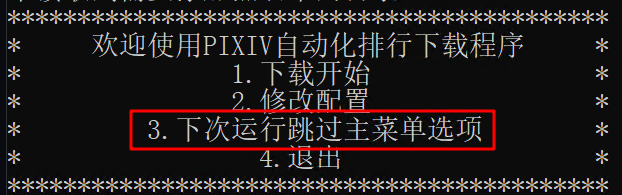

### 关于此项目

为了方便获取[PIXIV](https://www.pixiv.net/)每日排行榜的图片孕育而生的

###### v1.1.2

- 更新了初始化并且不需要手动修改配置文件,程序会引导修改
- 更新了主界面,可以输入选项进行不同的功能
- 更新了下次启动跳过主界面,用于自动化运行
- 删除了进度条(因为一些技术原因,后续版本会继续更新)
- 源码改成了框架,方便后续修改以及扩展

###### v1.0.0

- 获取排行
- 对每个画师创建单独的文件夹保存他的图片，文件夹名格式:画师名称_ID=画师ID
- 保存文件夹到配置文件里面配置的目录
- 对黑名单的画师的图片不进行下载
- 自动添加黑名单目录里的画师到黑名单,并删除黑名单目录下的图片

### 使用

第一次运行exe文件会创建 1.black_user.json 2.config.json

1. black_user.json为黑名单保存文件,如果不知道json就不要删除里面的东西,因为目前程序还没有对黑名单进行备份的功能
2. config.json用于保存配置信息

初始化完成后就会输出菜单,常见问题下方已经写了专门的处理办法

###### v1.1.2版本的跳过主菜单选项

输入3后,下次运行就不会弹出此菜单,直接进行下载

如果需要程序输出主菜单,进入程序运行目录找到options目录,删除此目录下的pass.dll,下次启动程序就会输出主菜单

### 可能出现的问题

V1.1.2版本暂时没有测试出问题

### 关于源码

这个项目的目的,最开始是方便我自己使用的,后来代码量越来越大,我朋友也开始想使用,我就将原始代码进行修改生成小白的也可以使用的exe文件,同时也是记录学习的一个笔记,源码也会放在一起,供大家学习,其实现在的代码是我原始项目的一半,我自己用的代码有400行代码,主要是没有任何输出,并且需要修改py文件,所以不适合小白使用

### 未来更新计划

- 后续会进行更详细的异常处理来提示不同的错误信息
- 日志:将调试信息输出到日志文件,后续会用于邮件的附件
- 支持QQ邮件发送通知结果(其他邮件的设置在考虑中)
- 更新进度条显示方式:现在进度条比较死板后续会进行修改
- 目前的代码还不适合进行任务计划部署,后续完善代码后会写教程如何部署任务计划,每日自动运行

### 期望

不论是小白或者是大佬,都可以给我提出修改建议,不论是功能方面还是代码方面,如果使用时候有什么使用不佳的地方都可以给我提出,qq邮箱:754587525@qq.com
