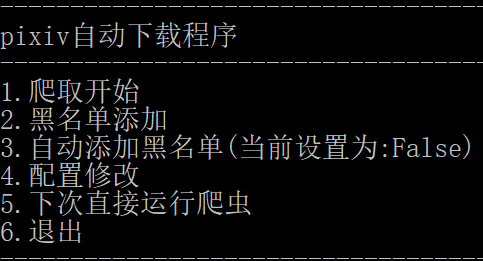
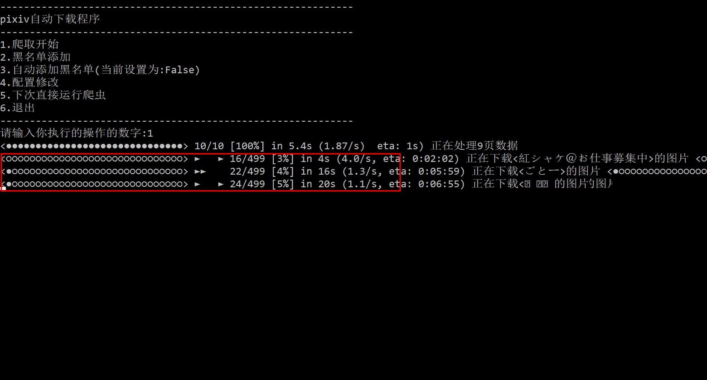
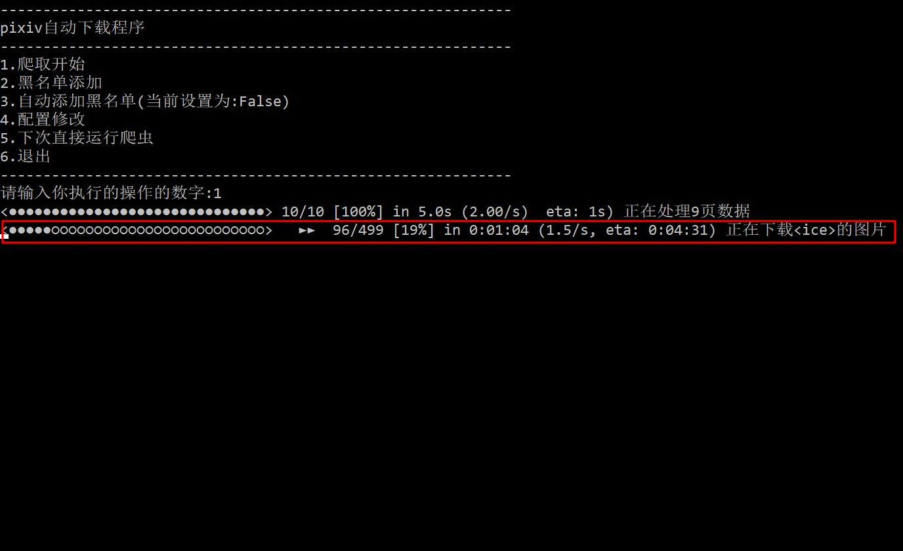

### 关于此项目

为了方便获取[PIXIV](https://www.pixiv.net/)每日排行榜的图片孕育而生的

模块设计的脑图:[Pixiv爬虫](http://note.youdao.com/noteshare?id=e0778662a548a95772980931d22c3cee)

###### v1.1.5

- 更新了进度条,排行处理以及图片下载都会显示
- 更新了主界面样式
- 更新了下载时可以通过ctrl+c退出下载
- 可以设置是否自动添加黑名单的选项(默认是false)
- 添加手动添加黑名单选项
- 添加了程序的图标(暂定此图标)
- 模块功能以及名称调整
- 修复了文件夹名称没有正确删除字符的bug

###### v1.1.2

- 更新了初始化并且不需要手动修改配置文件,程序会引导修改
- 更新了主界面,可以输入选项进行不同的功能
- 更新了下次启动跳过主界面,用于自动化运行
- 删除了进度条(因为一些技术原因,后续版本会继续更新)

###### v1.0.0

- 获取排行
- 对每个画师创建单独的文件夹保存他的图片，文件夹名格式:画师名称_ID=画师ID
- 保存文件夹到配置文件里面配置的目录
- 对黑名单的画师的图片不进行下载
- 自动添加黑名单目录里的画师到黑名单,并删除黑名单目录下的图片

### 使用

###### 第一次运行

会自动创建 

|                       black_user.json                        |   config.json    |             backup             |    options     |
| :----------------------------------------------------------: | :--------------: | :----------------------------: | :------------: |
| 如果不知道json就不要删除里面的东西,因为目前程序还没有对黑名单进行备份的功能 | 用于保存配置信息 | 用于备份(目前还没有备份的功能) | 各种简易的设置 |

###### 主菜单

###### 爬虫开始

程序会根据你配置的下载路径进行自动下载,会按照**画师昵称**和**画师id**创建画师的个人目录

###### 黑名单添加

程序会根据配置的黑名单目录,添加黑名单目录下的画师进入黑名单,并且自动删除所有黑名单目录下的文件

###### 自动添加黑名单

默认是false,不自动添加,改成true后,程序在主菜单输出前会自动执行黑名单添加操作

###### 配置修改

想修改配置的话

##### 下次直接运行爬虫

会跳过主菜单,直接进行爬虫开始,然后程序会自动关闭

###### 需要再次输出主菜单的调整

进入程序运行目录找到options目录,**删除此目录下的skip.dll**,下次启动程序就会输出主菜单

### 可能出现的问题

- 进度条不停往下刷新:这个是代码没法修复的,因为使用cmd来输出内容,cmd的缓冲区长度不够就会进入下一行,导致不停往下刷新,解决办法增加缓冲区长度,以下是修改步骤

实际上开始处理应该在一行刷新的,解决办法如下

这样就解决了,重新运行程序即可

### 关于源码

这个项目的目的,最开始是方便我自己使用的,后来代码量越来越大,我朋友也开始想使用,我就将原始代码进行修改生成小白的也可以使用的exe文件,同时也是记录学习的一个笔记,源码也会放在一起,供大家学习,其实现在的代码是我原始项目的一半,我自己用的代码有400行代码,主要是没有任何输出,并且需要修改py文件,所以不适合小白使用

### 未来更新计划

- 后续会进行更详细的异常处理来提示不同的错误信息
- 日志:将调试信息输出到日志文件,后续会用于邮件的附件
- 支持QQ邮件发送通知结果(其他邮件的设置在考虑中)

### 期望

不论是小白或者是大佬,都可以给我提出修改建议,不论是功能方面还是代码方面,如果使用时候有什么使用不佳的地方都可以给我提出,qq邮箱:754587525@qq.com
